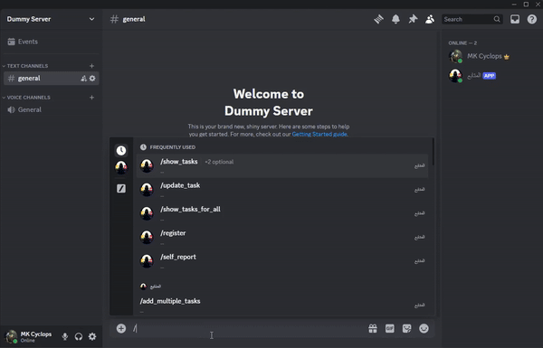

# Al-Mutabie-Discord-Bot

## Overview

Al-Mutabie-Discord-Bot is a to-do list bot designed to help you manage your weekly tasks efficiently. With functionalities including task addition, updates, deletions, profile management, weekly reminders, and penalties for incomplete tasks, this bot aims to streamline your task management within a Discord server. 📅

## Demo GIF 🎥




## Installation 🛠️

You can either invite the bot to your server or use it locally.

### Invite the bot to your server!
Our bot is deployed on Amazon EC2 cloud server. You can get a link to add the bot to your server by [Contacting us](#contact-us-📬).

### Use it on your local computer with your own bot 💻
1. Clone the repository:
    ```bash
    git clone https://github.com/ShehabDiab0/Al-Mutabie-Discord-Bot.git
    cd Al-Mutabie-Discord-Bot
    ```

2. Install the required dependencies:
    ```bash
    pip install -r requirements.txt
    ```

3. Set up environment variables:
    Create a `.env` file in the root directory and add your Discord bot token:
    ```env
    API_TOKEN=your_discord_bot_token
    ```

4. Run the bot:
    ```bash
    python main.py
    ```

## Usage & Guides 📖

### Rules 📝
- Week starts & Reminders ==> Friday 00:00
- Penalties ==> Sunday 00:00
- Completion Threshold Percentage ==> is the percentage of tasks you would like to finish each week (e.g., > 50% of tasks have to be done)
- Yellow Card ==> is a penalty you would like to do (preferably to motivate you) when you do not write your tasks or pass your threshold
- Red Card ==> same as Yellow Card but more strict and you get banned if you get it (you have to do it before contacting)
- You get a penalty in 3 conditions (yellow card then red card):
  1. You did not complete enough tasks to pass the threshold percentage you registered with.
  2. You did not write your tasks on time.
  3. You did not complete your previous penalty (You have to mark it as done).
- You get a red card if you have 1 penalty the previous week and you receive a new one.
- Warning: getting a red card would ban you from using the bot.
- You get kicked once getting a red card if the server allows kicks from the bot.

### Brief guideline 🗂️

1. Use `/help` to get all the commands and their instructions.
2. `/register` to subscribe to the bot.
3. `/show_profile` to show your profile.
4. `/add_multiple_tasks` and start working!
5. `/self_report` to update multiple tasks progress!

### Project Structure 📂
```bash
Al-Mutabie-Discord-Bot/
│
├── main.py # main entry point
├── client.py # connecting and running bot and db, general commands and events
├── UI.py # contains UI components using discord.ui components for interactivity
├── database.py # has the database connection and version control
├── penalty_scheduler.py # handles the scheduler to apply penalties at scheduled times
├── constants.py # contains all the constants we use
├── helpers.py # utility functions and helpers
├── requirements.txt # List of Dependencies
├── models/ # Directory containing structs and models
│   ├── guild.py 
│   ├── penalty.py 
│   ├── subscriber.py 
│   ├── task.py 
│   └── week.py
├── migrations/ # Directory for migrations and its versions (sorted by date, date_MigrationName)
│   └── 20240701235624_init.py # version 1
├── data_access/ # Directory for each file/model that access the database tables
│   ├── guilds_access.py # Access the guild table
│   ├── penalties_access.py # Access the penalties table
│   ├── subscribers_access.py # Access the subscribers table
│   ├── tasks_access.py # Access the tasks table
│   └── weeks_access.py # Access the weeks table
└── controllers/ # Directory containing commands inside discord
│   ├── guilds_commands.py
│   ├── penalties_commands.py
│   ├── subscribers_commands.py
│   ├── tasks_commands.py
│   └── weeks_commands.py
 
```
## Contribution 🤝
Contributions are welcomed!

### Workflow 🔄
1. Fork the repository.
2. Create a new branch (`git checkout -b feat/branch`).
3. Work on your branch and test your work.
4. Open a pull request.

### Branch Naming Convention

Ex. `feat/take_break`
1. Use a meaningful and descriptive token/label like `feat` at the start of the branch.
2. Write a descriptive but relatively short description of what you are doing.
3. Separate token/label from the description using a slash `/`

Some predefined tokens:
1. `wip`: Work in progress, modifications that don't really have a time frame.
2. `hotfix`: When there's an issue/bug in the production code in the `main` branch.
3. `feat`: Feature you are working on.
4. `junk`: Experiments are done here.
5. `new`: Working on anything new in general like `documentation`.
6. `bug`: Bug fixes.
7. `refactor`: When you refactor some code (similar to wip but precise).

Examples:
1. `feat/self_report`: You are working on a feature called self_report.
2. `refactor/self_report`: You are refactoring an existing feature `self_report` to make it better.
3. `hotfix/self_report`: There is a bug or security vulnerability in `self_report` production code and it needs to be fixed ASAP.

### Production Code
These might be `upcoming` changes in the branches:<br>
`main`: This is the code for production that is well-tested and safe to use and deploy that people are using.<br>
`development`: This is used for development and testing before merging to main.

## Contact Us 📬
Mail: [Shehab Diab](mailto:shehabgehaddiab@gmail.com) or [Omar Elgammal](mailto:omarelgammal2004@gmail.com)<br>
LinkedIn: [Shehab Diab](https://www.linkedin.com/in/shehab-diab/) or [Omar Elgammal](https://www.linkedin.com/in/omarelgammal1/)
